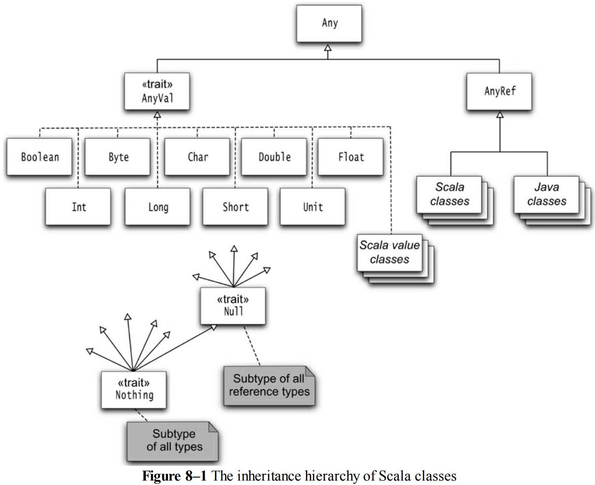

% Inheritance Details in Scala
% <a href="mailto:raffi.khatchadourian@hunter.cuny.edu">Raffi Khatchadourian</a>
% September 22, 2020

# Inheritance Details

## Highlights

- `extends` and `final` keywords are similar to those in Java.
- Like Java, Scala supports only single-class inheritance.
- You must use the `override` keyword when you override a method.
    - This is similar to the `@Override` annotation in Java.
- You can override fields.

## Extending a Class

```scala
class Employee extends Person {
    var salary = 0.0
    // ...
}
```

## Overriding a Method

```scala
class Person(val name: String) {
    override def toString = s"${getClass.getName}[name=$name]"
}

val p = new Person("Juan")
println(p)
```

. . .

Outputs:
```
Person[name=Juan]
```

## Protected Fields and Methods

- Like C++ and Java, you can declare a member to be `protected`.
- The member is accessible from subclasses only.
    - Unlike Java, it is not "package protected."
    - Use *package objects* for that.

## Overriding Fields

Recall that a *field* in Scala consists of:

1. A private instance field.
1. Accessors/mutators for the field.

You can override a `val` (or parameterless `def`) with another `val` field of the same name.

Then, the subclass will have a private field and a public accessor, which overrides the one from the super class.

```scala
class Person(val name: String) {
    override def toString = s"${getClass.getName}[name=$name]"
}

class SecretAgent(codename: String) extends Person(codename) {
    override val name = "secret"
    override def toString = "shh"
}

val s = new SecretAgent("1234")
println(s)
```
. . .

Outputs:
```
shh
```

## Abstract Classes & Methods

Can also override an *abstract* `def` with a `val`:

```scala
abstract class Person {
    def id: Int // No implementataion, specific to each kind of person.
    // ...
}

/**
 * A concrete implementation of Person.
 */
class Student(override val id: Int) extends Person {
    // The student ID is supplied by the ctor.
    // ...
    override def toString = s"Student with ID: ${id}"
}

val s = new Student("54321")
println(s)
```

. . .

Outputs:
```
Student with ID: 54321
```

 `override` keyword not required when providing an implementation for an abstract method.

## Abstract Fields

Can also have *abstract* fields, i.e., fields without an initial value:

```scala
abstract class Person {
    val id: Int // No initializer---abstract field and accessor.
    var name: String // No initializer---abstract field, accessor, and mutator.
    // ...
}
```

- Class in Java bytecode has *no* fields.
- Concrete subclasses must "fill" these in:

```scala
class Employee(val id: Int) extends Person { // Has a concrete id property.
    var name = "John Doe"  // and a concrete name property that can be concretized.
    override def toString = s"Employee ${name} with ID: ${id}"
}

val e = new Employee(5)
println(e)
```

. . .

Outputs:
```
Employee John Doe with ID: 5
```
What if we did not override `name`? What would happen? 

## Scala Inheritance Hierarchy

:::::::::::::: {.columns}
::: {.column width="50%"}

- Primitive type classes and `Unit`, i.e., `()`, extend `AnyVal`.
    - These are *value classes*.
    - `AnyVal` has no methods; it's just "marker."
- Reference types extend `AnyRef`.
    - In the bytecode, this is `java.lang.Object`.
    - Defines methods useful for concurrency (e.g., locking).
- `Any` is the hierarchy root. It defines:
    - `isInstanceOf[]`
    - `asInstanceOf[]`
    - Equality and hash code methods.
- All Scala classes implement the marker interface `ScalaObject`.
- `Null` is a singleton type with the value `null`.
    - You can assign `null` to any reference.
- `Nothing` has *no* instances.

:::
::: {.column width="50%"}

{width=90% title="Courtesy \"Scala for the Impatient\" by Cay Horstmann."}

:::
::::::::::::::

## `Nothing`

- Useful for generic constructs.
    - The empty list `Nil` has the type `List[Nothing]`.
    - It's a subtype of `List[T]` for any `T`.
- The method `???` has return type `Nothing`.
    - It actually never returns but throws `NotImplementedErr`.
    - Useful for methods that have not yet been implemented:
	```scala
	class Person(val name: String) {
	    def speak() {println(s"My name is ${name}.")}
	    def description = ???
	}

	val p = new Person("Sofia")
	p.speak() // OK!
	println(p.description)
	```

	Outputs:

	```
	My name is Sofia.
	scala.NotImplementedError: an implementation is missing ...
	```

## Object Equality

::: incremental
- The `eq` method of `AnyRef` checks whether two references refer to the same object.
- The `equals` method in `AnyRef` calls `eq`.
- When designing your own classes, consider overriding `equals` method:
    - Two `Item` objects may be "equal" if they have the same description and price.
    - Are two people with the same name equal? In other words, if two references refer to objects whose `name` fields are equal, do the references refer to the *same* object?
        - The answer is no.
        - In this case, you may choose *not* to override the `equals` method unless there is some other unique identifier.
- If you do override `equals`, you *must* also override `hashCode`:

    ```scala
    final override def hashCode = (description, price).##
    ```

    - Combines the hash codes of the fields.
    - The `##` method is a null-safe version of the `hashCode` method.
        - It returns 0 for `null` instead of throwing an exception.
- Don't call `eq` or `equal` from *application* code. Instead, use `==`, which, for reference types, checks for `null` and calls `equals`.
:::

## Value Classes

- For "wrapper" classes that have a single field. Can you think of any?
- Inefficient to allocate a new object that holds only one value.
- Value classes allow you to "inline" field access so it is accessed *directly*.

A value class:

1. Extends `AnyVal`.
1. Has a primary ctor with only one (`val`) parameter, i.e., the "wrapped" value, and *no* body.
1. Has no other fields or ctors.
1. Automatically provides `equals` and `hashCode` methods that simply delegate to the wrapped value.

### Example

```scala
class MilTime(val time: Int) extends AnyVal {
    def minutes = time % 100
    def hours = time / 100
    override def toString = f"$time%04d"
}
```
